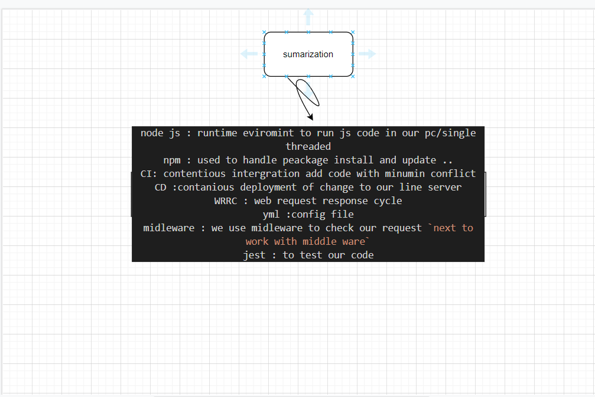

## server-deployment-practice.

1-How do I install the app or library?
npm install (name of library )
2-How do I test the app or library?
run this commend npm test in ubuntu

## .env requirements

PORT - 3000

{
"domain": "https://raneem-server-deploy-dev.herokuapp.com",
"domain": "https://raneem-server-deploy-prod.herokuapp.com",
"status": "running",
"port": 42123
}

## For Applications:

How do I run the app?
npm run dev 

How do I set up the app?
from the package.json 

[pull request](https://github.com/raneemabujamous/server-deployment-practice/tree/dev)

### sumrization

